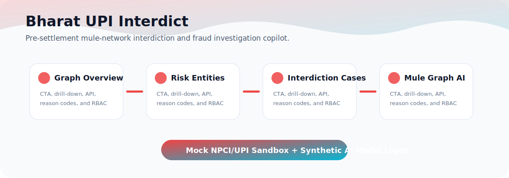

  

  

<h1 align="center">Bharat UPI Interdict</h1>

<strong>Pre-settlement mule-network interdiction and explainable fraud investigation copilot.</strong>

  
  
  
  
  

  <a href="#product-story">Product Story</a> &middot;
  <a href="#architecture">Architecture</a> &middot;
  <a href="#run-locally">Run Locally</a> &middot;
  <a href="#documentation">Documentation</a>

## Product Story

A graph-risk prototype that reconstructs mule-chain movement, scores suspicious entities, recommends pre-settlement holds, and creates investigation-ready summaries for fraud operations.

This is a synthetic-data, portfolio-grade UPI AI infrastructure prototype. It does not connect to live UPI rails, NPCI, PSPs, banks, account aggregators, or real customer data.

**Author:** Prashant Jagtap <jprbom@gmail.com>

## Experience Preview

  

## What Makes It Portfolio-Strong

| Layer | What it demonstrates |
| --- | --- |
| Product thinking | UPI-native workflow, role-aware operating model, and explainable decisioning |
| Frontend | Modern React/Vite command center with animated KPI panels and CRUD controls |
| Backend | Express API with Helmet, CORS, rate limiting, RBAC, Zod validation, and JSON persistence |
| AI simulation | Deterministic domain engine with reason codes and human-readable explanation |
| SDLC | Project plan, API docs, security notes, tests, Docker files, and rich diagrams |

## Core Modules

| # | Module | Flow |
| ---: | --- | --- |
| 1 | Mule graph scorer | Entity graph |
| 2 | Pre-settlement hold | Risk signals |
| 3 | Device/VPA ontology | Interdiction score |
| 4 | Case copilot | Hold decision |
| 5 | Compliance reason codes | Investigation summary |

## RBAC Personas

`Investigator` `Compliance Officer` `Bank Partner`

Destructive operations are admin-only. Read/write operations are guarded through a role-to-permission map in the backend middleware.

## Architecture

~~~mermaid
flowchart LR
  UI["React RBAC Command Center"]:::ui --> API["Express API"]:::api
  API --> SEC["Helmet + CORS + Rate Limit"]:::sec
  API --> RBAC["RBAC Permission Gate"]:::sec
  API --> VALID["Zod Validation"]:::sec
  API --> CRUD["Risk Entities + Interdiction Cases CRUD"]:::api
  API --> ENGINE["Interdict risky network Engine"]:::ai
  CRUD --> DB[("Synthetic JSON DB")]:::data
  ENGINE --> EXPLAIN["Reason Codes + Explanation"]:::ai
  EXPLAIN --> UI

  classDef ui fill:#ecfeff,stroke:#22d3ee,stroke-width:2px,color:#083344
  classDef api fill:#fff7ed,stroke:#ef4444,stroke-width:2px,color:#431407
  classDef sec fill:#fee2e2,stroke:#ef4444,stroke-width:2px,color:#450a0a
  classDef ai fill:#eef2ff,stroke:#22d3ee,stroke-width:2px,color:#1e1b4b
  classDef data fill:#dcfce7,stroke:#f59e0b,stroke-width:2px,color:#052e16
~~~

## API Surface

| Purpose | Endpoint |
| --- | --- |
| Health and role catalogue | `GET /api/health` |
| Dashboard metrics | `GET /api/metrics` |
| Domain decision | `POST /api/interdiction-score` |
| Primary CRUD | `Risk Entities` |
| Secondary CRUD | `Interdiction Cases` |

## Run Locally

~~~bash
npm install
npm run dev:backend
npm run dev:frontend
~~~

Backend: http://127.0.0.1:4102

Frontend: http://127.0.0.1:5172

Preview build: http://127.0.0.1:5102

## Verify

~~~bash
npm run verify
~~~

`npm run verify` runs TypeScript build, backend/frontend tests, and `npm audit --audit-level=high`.

## Documentation

- [Project Plan](docs/PROJECT_PLAN.md)
- [Architecture](docs/ARCHITECTURE.md)
- [API Reference](docs/API.md)
- [Security](docs/SECURITY.md)
- [Testing](docs/TESTING.md)
- [Rich Diagrams](docs/DIAGRAMS.md)

## Repository

`bharat-upi-interdict`

