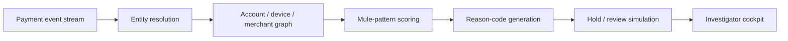

  

  

  
  
  

# Bharat UPI Interdict

**Pre-settlement mule-network interdiction and fraud investigation copilot.**

This repository is a public concept showcase. It explains the product thesis, investigation model, AI/ML role, ecosystem impact and investor narrative. It does not expose proprietary source code, fraud rules, graph models, scoring weights, credentials, datasets, prompts or production integrations.

---

## Why this matters

UPI fraud is increasingly networked. Mule accounts, layered beneficiaries, fast cash-out, merchant camouflage and device/account reuse can defeat isolated transaction checks. By the time a manual review starts, value may already move across multiple hops.

The gap is not just fraud detection. The gap is **early interdiction with explainable investigator workflow**.

## Product thesis

Bharat UPI Interdict maps suspicious UPI-like payment flows into an entity graph, clusters mule-network signals, ranks interdiction priority, simulates hold/review decisions and generates explainable reason codes for fraud teams.

---

## Concept flow

## Investor-grade capability map

| Layer | Capability | Value |
|---|---|---|
| Market | UPI fraud and mule-network intelligence | Addresses a real ecosystem pain point |
| Product | Investigator cockpit and review simulation | Converts risk signal into action workflow |
| AI/ML | Graph clustering and anomaly patterns | Improves prioritisation and detection depth |
| Platform | Event-driven risk API model | Can integrate with bank/PSP risk operations |
| Governance | Explainable reason codes and audit trail | Supports controlled, accountable decisions |

---

## What visitors should understand in 60 seconds

- Mule risk is a network problem, not only a transaction problem.
- Interdiction requires explainability, not just a black-box score.
- Synthetic/sandbox events can validate the product without touching regulated rails.
- The defensible layer is graph intelligence, risk reasoning, alert prioritisation and investigator UX.
- Proprietary models, rules and data structures are intentionally not public.

## Success metrics

| Metric | Why it matters |
|---|---|
| Mule cluster detection precision | Risk-model credibility |
| False-positive control | Operational viability |
| Investigation turnaround time | Fraud-ops productivity |
| Fraud value at risk identified | Commercial and ecosystem value |

## Validation scenarios

- Circular mule flows
- Burst credit and fast cash-out
- Beneficiary fan-out
- Device reuse across accounts
- Merchant camouflage
- Layered transfers across weak accounts

## Positioning

Bharat UPI Interdict sits at the intersection of UPI risk, graph intelligence, fraud operations and explainable AI for financial crime investigation.

**Owner:** [Prashant Jagtap](https://github.com/jprbom)  
**Repository type:** Public showcase, proprietary concept
