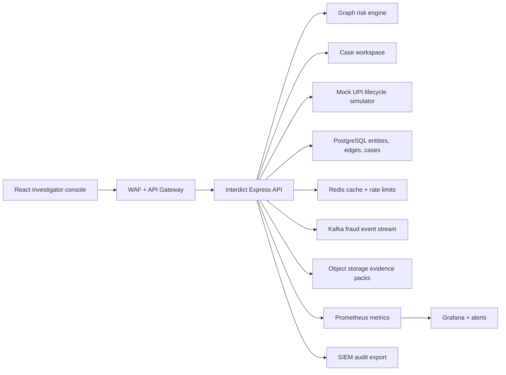
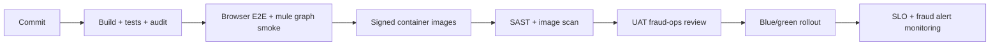

# Enterprise Cloud Deployment

Author: Prashant Jagtap <jprbom@gmail.com>

This repository is a runnable portfolio MVP today. The enterprise target is a pre-settlement fraud investigation and mule-network intelligence platform where banks, PSPs, and fraud operations teams can inspect synthetic UPI entity graphs, score mule clusters, and produce auditable hold recommendations.

## Reference Architecture



## Cloud Mapping

| Layer | AWS | Azure | GCP |
| --- | --- | --- | --- |
| App runtime | EKS/ECS/Fargate | AKS/Container Apps | GKE/Cloud Run |
| Graph store target | Neptune/PGVector | Cosmos DB/PostgreSQL | AlloyDB/Neo4j marketplace |
| Transaction DB | RDS PostgreSQL | Azure PostgreSQL | Cloud SQL |
| Events | MSK/SQS | Event Hubs/Service Bus | Pub/Sub |
| Secrets | Secrets Manager/KMS | Key Vault | Secret Manager/KMS |
| Observability | CloudWatch/AMP/Grafana | Azure Monitor/Grafana | Cloud Monitoring |

## Production Interdict Differentiators

- Entity graph with VPA, device, account, merchant, victim, and case nodes.
- Connected-component, circular-flow, fan-in/fan-out, device-reuse, and sink-account scoring.
- Pre-settlement hold simulation with reason codes and investigator narrative.
- Case workspace with audit trail, notes, review status, and evidence export.
- Kill-switch recommendations scoped by cluster, not only by single transaction.

## Required Variables

```text
NODE_ENV=production
PORT=4102
CORS_ORIGIN=https://interdict.example.com
DATABASE_URL=postgresql://...
REDIS_URL=redis://...
KAFKA_BROKERS=broker-1:9092
OIDC_ISSUER=https://issuer.example.com
OIDC_AUDIENCE=bharat-upi-interdict-api
AUDIT_EXPORT_TOPIC=interdict.audit.events
```

## Security Controls

The current role selector is a demo RBAC simulator. Enterprise deployment must enforce OIDC/JWT auth, backend-side roles, tenant ID on every record, immutable audit logs, signed callbacks, idempotency keys, and maker-checker approval for case closure and hold decisions.

## Data Model Target

```text
tenants, users, roles, permissions
entities, entity_edges, upi_transfers, risk_clusters
fraud_cases, case_notes, hold_decisions, investigator_actions
risk_decisions, decision_reason_codes, model_versions
model_predictions, human_reviews, audit_logs
```

## Deployment Flow



## Observability

Operational endpoints:

- `GET /api/live`
- `GET /api/ready`
- `GET /api/metrics/prometheus`

Dashboards should track graph scoring latency, cluster count, high-risk node count, hold decision rate, investigator override rate, RBAC denials, mock rail latency, and audit export success.

## Enterprise Readiness Checklist

- Replace JSON persistence with PostgreSQL and graph-query optimized repositories.
- Add OpenAPI schemas and response validation.
- Add real JWT tests for forged role denial.
- Add Grafana dashboards and alert rules.
- Add model governance: model card, threshold policy, drift monitoring, false-positive review loop.
- Keep all payment data synthetic until live UPI access is contractually approved.
